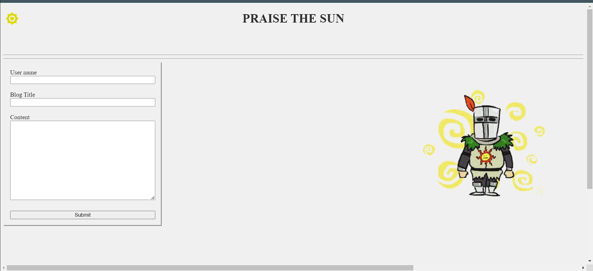
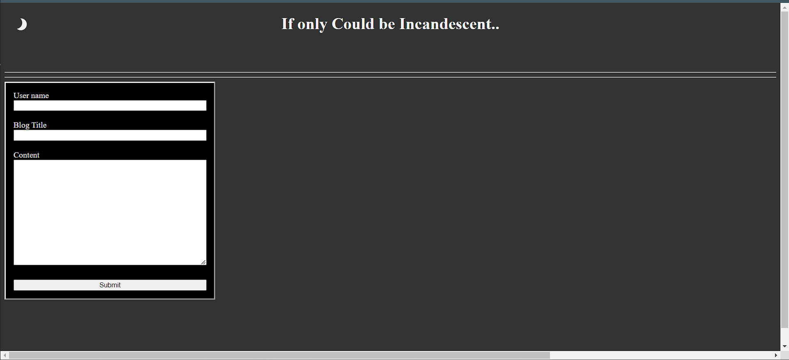
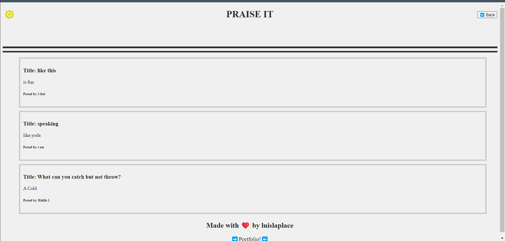
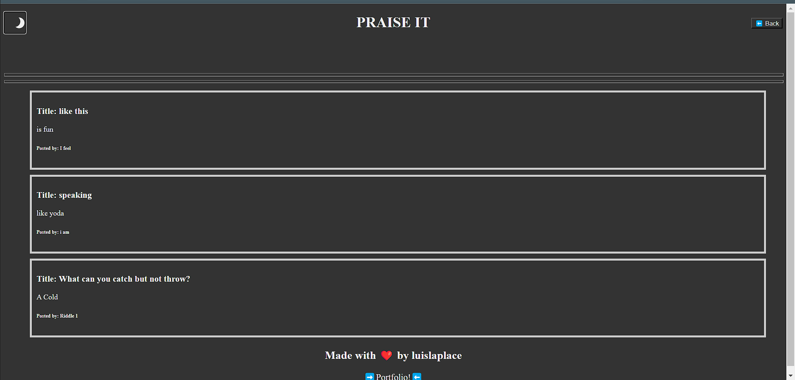

# 04 Web APIs: Personal Blog
Building a blog site that contains a landing page

## Table of Content
1. blog.html contains the blog page
2. index.html contains the landing page 
3. README.md is the document that you are reading right now
4. Assets folder contains the css and js documents for each of the blog and index html(s)

## Header
The h1 is made in JavaScript using: 
```
{
const x = document.createElement("h1")
x.textContent = "text here"
x.setAttribute('style', enter style here)
header.appendChild(x)
}
```
- Code was reviewed with the help of Xpert Learning Assistant

In the header there is a theme-switcher that on both pages but only the blog page has a back.  The theme-switcher is styled to look like a sun when in light-them(default) and a moon when in dark-theme. When the theme switches the content of of the body and all other elements that were coded will contain the class="dark-theme" and will contain the light-theme(default).  The back button will direct you back to the landing page.

## Aside
There is an aside within the index.html that contains the label and input for a blog entry.  It has an entry for username, blog title, and blog content.  When you click on the submit button it is stored locally using this:
```
{function postBlog(event) {
    let user = document.getElementById('user').value;
    let title = document.getElementById('title').value;
    let text = document.getElementById('text').value;

    if (user === '' || title === '' || text === '') {
        alert('Please fill out all fields before posting.');
        event.preventDefault();
        console.log("Error entry");
    } else {
        let newPost = { user: user, title: title, text: text };
        let posts = JSON.parse(localStorage.getItem('posts')) || [];

        let isDuplicate = posts.some(post => post.user === user && post.title === title && post.text === text);

        if (isDuplicate) {
            alert('This post already exists.');
        } else {
            posts.push(newPost);
            localStorage.setItem('posts', JSON.stringify(posts));
        }
    }
}}
```
- code was made with the help of Xpert Learning Asistant

there is an alert if any of the values are empty and if there is a duplicate when you try to submit a document.


## Image
I added a GIF of the character Solair from the game "Dark Souls".  It has a white backdrop which would pop out if left alone.  Using `{mix-blend-mode: darken}` in the css file, will make the backdrop blend easily with the rest of the page.  When the dark-theme is active, solair dissapears.  But worry not! He comes back when the sun is visible.


## Main
In the localStorage you will be able to see the entries under the array. It is empty when you clear the localStorage but it will boxes when you submit entries in the landing page.  The entries are generated as a list entries but they are styled to look like different.
```
{const storedPost = JSON.parse(localStorage.getItem('posts'));

if (storedPost) {
    const postList = document.getElementById('postList');

    storedPost.forEach(post => {
        const listItem = document.createElement('li');
        listItem.setAttribute('style', 'list-style: none; position: relative; border: 5px solid #ccc; padding: 10px; margin-bottom: 10px;');


        const h3El = document.createElement('h3');
        h3El.textContent = `Title: ${post.title}`;

        const pEl = document.createElement('p');
        pEl.textContent = post.text;

        const h6El = document.createElement('h6');
        h6El.textContent = `Posted by: ${post.user}`;


        listItem.appendChild(h3El);
        listItem.appendChild(pEl);
        listItem.appendChild(h6El);

        postList.appendChild(listItem);
    });
}}
```
- Code was made with the work of Xpert Learning Asistant

## Footer
In the footer you will find a little text blurb by me along with a link to the portfolio from previous work


### Sources
https://github.com/LuisLaplace/my-little-blog
https://luislaplace.github.io/my-little-blog/
https://luislaplace.github.io/my-little-blog/blog.html?User=&title=&text=





